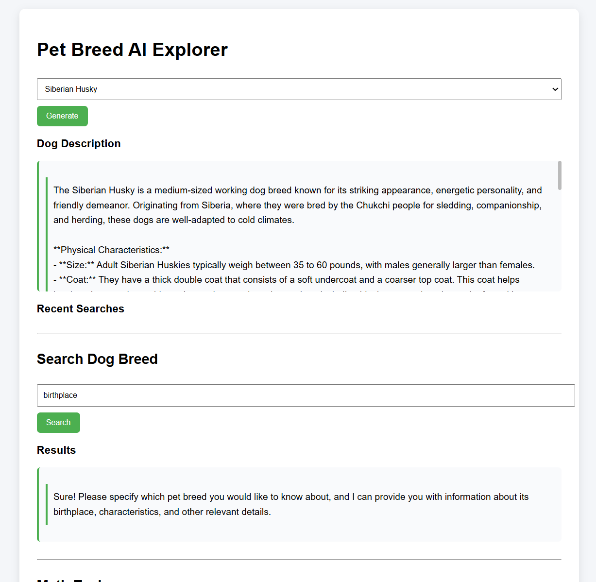

## Application Interface

## Pet Breed AI Explorer

Pet Breed AI Explorer is a small AI-powered web application built using **FastAPI, LangChain, and OpenAI** that allows users to explore information about different dog breeds. Users can select a breed from a dropdown menu or search for a specific dog breed, and the system generates a detailed description using a Large Language Model. The application also highlights popular countries where the breed is commonly found, providing useful contextual information about each breed. The interface is built with a simple HTML/CSS frontend connected to a FastAPI backend, demonstrating how modern AI models can be integrated into traditional web applications.
Features

• FastAPI backend
• LangChain LLM chains
• AI-generated pet breed descriptions
• Math calculation tool
• Memory of last interactions
• Clean UI using HTML + CSS

pip install fastapi uvicorn langchain langchain-openai python-dotenv numexpr jinja2